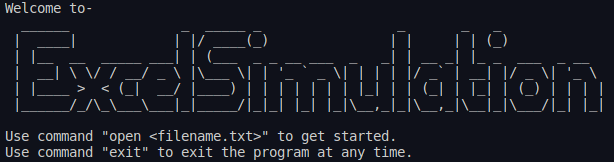

# Excel Simulation Project
Welcome to the Excel Simulation project, a command-line interface application that simulates basic functionalities of an Excel spreadsheet. This application allows users to interact with and manipulate spreadsheet data through a variety of commands.
Table of Contents



# Features
- **File Management**: Open existing text files as spreadsheets or create new ones on the fly.
- **Spreadsheet Interaction**: Navigate, edit, and manage data directly within the spreadsheet interface.
- **Formula Support**: Input and compute basic formulas, converting your spreadsheet into a powerful calculator.
- **Cell Editing**: Directly change the content of cells using easy-to-understand commands.
- **Data Visualization**: View your spreadsheet data in a clean, organized manner and observe the data types of each cell.
- **File Saving**: Safeguard your changes by saving your progress back into the text file.
- **Session Management**: Easily close your current spreadsheet, open another, or exit the program entirely when you're done.

# Requirements
- C++ compiler (e.g., g++)
- cmake

# Installation
1. Clone the repository:

```shell
git clone git@github.com:yourusername/excel-simulation.git
```

2. Build the application:
-if you are using a Linux distro (or Mac)-

In the main path, type:
```shell
./configure.sh
```

build it,
```shell
./build.sh
```

and run it,
```shell
./run.sh
```

-if you are using Windows

In the main path, type:
```shell
mkdir build
```

```shell
cd build
```

```shell
cmake ..
```

```shell
make
```

and execute it,
```shell
./excel.exe
```

# Getting Started
Once you've built the project, you can start interacting with the Excel Simulation application. To open an existing text file or create a new one if it does not exist, use the open <filename.txt> command:

```shell
>open example.txt
Text file opened successfully.
```

You can exit the program at any time using the exit command.

# Available Commands
Below is a list of commands available in the Excel Simulation project:

**1. Print**

Displays the content of the currently opened spreadsheet in a presentable manner.
```shell
>print

```

**2.Print types**

Displays the data types of the contents in each cell of the spreadsheet.
```shell
>print types
```

**3. Edit row_number column_number new_value** (rows and columns start from 1)

Edits the value of a cell in the spreadsheet using integer values for rows and columns.
```shell
>edit 1 2 150
```

**4. Save**

Saves any changes made to the currently opened file.

```shell
>save
```

**5. Close**

Closes the currently opened file, ensuring all changes are saved, if command **save** has not been called the changes would not be saved.

```shell
>close
```

**6. Exit**

Exits the Excel Simulation program.
```shell
>exit
```

# How to Contribute
If you would like to contribute to the project or report issues, please feel free to open an issue or submit a pull request on our GitHub repository.
License

# License
This project is licensed under the MIT License.